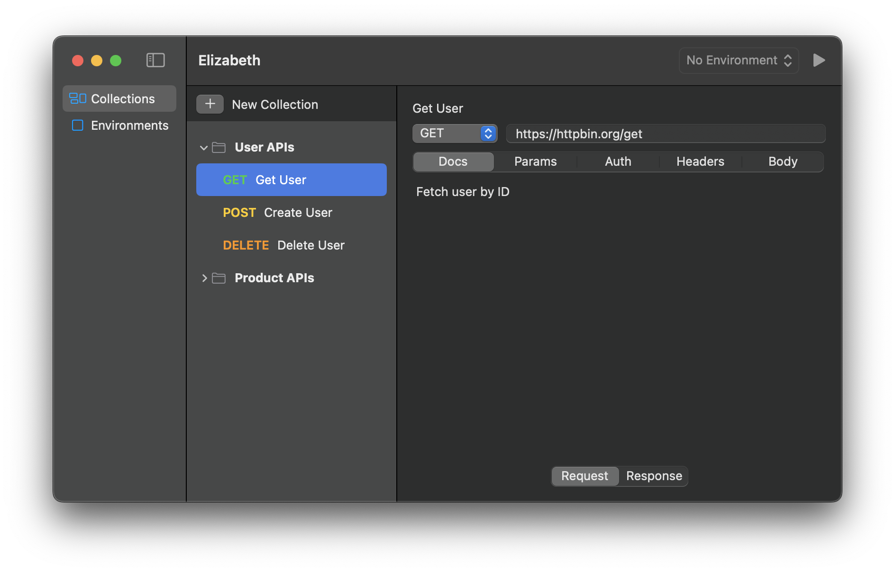

# Elizabeth

Elizabeth is an API testing tool written in Swift and SwiftUI.

This project was developed as part of a Swift programming course, covering 8 fundamental chapters: The Basics, Basic Operators, Strings and Characters, Collection Types, Control Flow, Functions, Closures, and Enumerations.

> [!IMPORTANT]  
> This is intentionally kept simple for now.  
> The project is limited to the first 8 chapters, so a lot of core stuff is missing.
>
> I'll clean this up and add more later.

## Requirements

macOS 15.7 or later

Xcode 26.2 or later

## Check List

Checklist tracking Swift concepts from The Swift Programming Language guide. Each topic represents a chapter with practical examples in the app.

**The Basics**

- [x] Declaring Constants and Variable
  - [x] Type Annotations
  - [x] Naming Constants and Variables
  - [x] Printing Constants and Variables
- [x] Comments
- [x] Semicolons
- [x] Integers
  - [ ] Integer Bounds
  - [x] [Int](Elizabeth/Utils2.swift#248)
  - [ ] UInt
- [x] [Floating-Point Numbers]()
- [x] [Type Safety and Type Inference](Elizabeth/Utils2.swift#L52)
- [ ] Numeric Literals
- [x] Numeric Type Conversion
  - [x] [Integer Conversion](Elizabeth/TestRDetail.swift#L421) <!-- Int64 -->
  - [x] [Floating-Point Conversion](Elizabeth/Utils2.swift#L361) <!--  Double(bytes) -->
- [x] [Type Aliases](Elizabeth/Utils2.swift#L87) <!-- HTTPReponse -->
- [x] [Booleans](Elizabeth/TestRDetail.swift#L46) <!-- isLoading -->
- [x] [Tuples](Elizabeth/Utils2.swift#87) <!-- HTTPReponse -->
- [x] Optionals
  - [x] [Nil](Elizabeth/TestR.swift#74) <!-- headers != nil -->
  - [x] [Optional Binding](Elizabeth/Utils2.swift#263) <!-- statusMessage -->
  - [x] [Providing a Fallback Value](Elizabeth/TestRDetail.swift#L301) <!-- statusCode -->
  - [x] [Force Unwrapping](Elizabeth/Utils2.swift#L131) <!--  finalResponse! -->
  - [ ] Implicitly Unwrapped Optionals
- [-] Error Handling
- [x] Assertions and Preconditions
  - [ ] Debugging with Assertions
  - [x] [Enforcing Preconditions](Elizabeth/Utils2.swift#L91)

**Basic Operators**

- [x] [Assignment Operator](Elizabeth/ElizabethApp.swift)
- [x] Arithmetic Operators
  - [x] [Addition (+)](Elizabeth/TestRDetail.swift#443)
  - [x] [Subtraction (-)](Elizabeth/TestRDetail.swift#283) <!-- duration -->
  - [x] [Multiplication (\*)](Elizabeth/Utils2.swift#L48) <!-- formatDuration -->
  - [x] [Division (/)](Elizabeth/Utils2.swift#L48) <!-- formatDuration -->
  - [ ] Remainder Operator
  - [ ] Unary Minus Operator
  - [ ] Unary Plus Operator
- [x] [Compound Assignment Operators](Elizabeth/Utils2.swift#) <!-- result += "UTF-8: " -->
- [x] [Comparison Operators](Elizabeth/Utils2.swift#L295) <!-- isOK -->
- [x] [Ternary Conditional Operator](Elizabeth/TestR.swift#L89) <!-- headers: finalHeaders.isEmpty ? nil : finalHeaders -->
- [x] [Nil-Coalescing Operator](Elizabeth/TestRDetail.swift#L301) <!-- statusCode -->
- [x] Range Operators
  - [x] [Closed Range Operator](Elizabeth/Utils2.swift#L294) <!-- isSuccess -->
  - [x] [Half-Open Range Operator](Elizabeth/Utils2.swift#L300) <!-- isClientError -->
  - [x] [One-Sided Ranges](Elizabeth/Utils2.swift#L305) <!-- isServerError -->
- [x] Logical Operators
  - [x] [Logical NOT Operator](Elizabeth/TestR.swift#L185) <!-- !self.isFocused -->
  - [x] [Logical AND Operator](Elizabeth/TestRDetail.swift#L404) <!-- hasPrefix && hasSuffix -->
  - [x] [Logical OR Operator](Elizabeth/TestRDetail.swift#L375) <!-- isCollection -->
- [ ] Combining Logical Operators
- [ ] Explicit Parentheses

**Strings and Characters**

- [x] String Literals
  - [ ] Multiline String Literals
  - [ ] Special Characters in String Literals
  - [ ] Extended String Delimiters
- [x] [Initializing an Empty String](Elizabeth/EnvironmentView.swift#L18)
- [ ] String Mutability
- [-] Strings Are Value Types
- [ ] Working with Characters
- [ ] Concatenating Strings and Characters
- [x] [String Interpolation](Elizabeth/Utils2.swift#L82)
- [x] Unicode
  - [ ] Unicode Scalar Values
  - [ ] Extended Grapheme Clusters
- [ ] Counting Characters
- [x] Accessing and Modifying a String
  - [x] [String Indices](Elizabeth/TestRDetail.swift#L87) <!-- let lastIndex -->
  - [x] [Inserting](Elizabeth/TestRDetail.swift#L104) <!-- url insert -->
  - [ ] Removing
- [x] [Substrings](Elizabeth/Utils2.swift#L404)
- [x] Comparing Strings
  - [x] [String and Character Equality](Elizabeth/Utils2.swift#L111) <!-- $0.key.lowercased() == "set-cookie" -->
  - [x] [Prefix and Suffix Equality](Elizabeth/TestRDetail.swift#L404) <!-- .hasPrefix("{") && .hasSuffix("}") -->
- [x] Unicode Representations of Strings
  - [x] [UTF-8 Representation](Elizabeth/Utils2.swift#L310) <!-- getEncodingDebug -->
  - [x] [UTF-16 Representation](Elizabeth/Utils2.swift#L310) <!-- getEncodingDebug -->
  - [x] [Unicode Scalar Representation](Elizabeth/Utils2.swift#L310) <!-- getEncodingDebug -->

**Collection Types**

- [x] Array
  - [x] [Array Type Shorthand Syntax](Elizabeth/AppState2.swift#L12) <!-- collections -->
  - [x] [Creating an Empty Array](Elizabeth/AppState2.swift#L12) <!-- collections -->
  - [ ] Creating an Array with a Default Value
  - [ ] Creating an Array by Adding Two Arrays Together
  - [x] [Creating an Array with an Array Literal](Elizabeth/AppState2.swift#L18) <!-- collections.append(contentsOf -->
  - [x] [Accessing and Modifying an Array](Elizabeth/TestR.swift#L220) <!-- append to collections -->
  - [ ] Iterating Over an Array
- [ ] Set
  - [ ] Creating and Initializing an Empty Set
  - [ ] Creating a Set with an Array Literal
  - [ ] Accessing and Modifying a Set
  - [ ] Iterating Over a Set
- [ ] Performing Set Operations
  - [ ] Fundamental Set Operations
  - [ ] Set Membership and Equality
- [x] Dictionary
  - [x] [Dictionary Type Shorthand Syntax](Elizabeth/Utils2.swift#L185) <!-- [:] -->
  - [x] [Creating an Empty Dictionary](Elizabeth/Utils2.swift#L184) <!-- buildHeaders -->
  - [x] [Creating a Dictionary with a Dictionary Literal](Elizabeth/Utils2.swift#219) <!-- getDefaultHeaders -->
  - [x] Accessing and Modifying a Dictionary
    - [x] [isEmpty](Elizabeth/TestRDetail.swift#L152) <!-- newParams.isEmpty -->
    - [x] [Add New](Elizabeth/TestRDetail.swift#L185) <!-- new params -->
  - [x] [Iterating Over a Dictionary](Elizabeth/Utils2.swift#L116) <!-- request.headers -->
    - [x] [Iterable collection of a dictionary’s keys or values](Elizabeth/TestRDetail.swift#L174) <!-- param keys -->

**Control Flow**

- [x] [For-In Loops](Elizabeth/Utils2.swift#L42)
- [x] While Loops
  - [x] [While](Elizabeth/TestRDetail.swift#L54) <!-- normalizeURL -->
  - [ ] Repeat-While Loops
- [x] Conditional Statements
  - [x] [If](Elizabeth/TestRDetail.swift#L58)
    - [ ] If Expression
  - [x] [Switch](Elizabeth/Utils2.swift#L15)
    - [ ] Switch Expression
    - [x] [Interval Matching](Elizabeth/Utils2.swift#L31) <!-- statusColor -->
    - [-] Tuples
    - [-] Value Bindings
- [x] Patterns
  - [x] [If](Elizabeth/TestR.swift#L123)
  - [ ] For-In
- [x] Control Transfer Statements
  - [x] [Continue](Elizabeth/SideBarView.swift#L34) <!--  continue SearchLoop -->
  - [x] [Break](Elizabeth/Utils2.swift#141) <!-- break if not error -->
  - [ ] Fallthrough
  - [x] [Labeled Statements](Elizabeth/SideBarView.swift#L25) <!-- SearchLoop -->
- [x] [Early Exit](Elizabeth/Utils2.swift#L51) <!-- guard statement -->
- [x] [Deferred Actions](Elizabeth/TestRDetail.swift#L335)
- [x] [Checking API Availability](Elizabeth/TestR.swift#L311)

**Functions**

- [x] Defining and Calling Functions
- [x] Function Parameters and Return Values
  - [x] [Functions Without Parameters](Elizabeth/Utils2.swift#L12) <!-- getDefaultUserAgent -->
  - [x] [Functions With Multiple Parameters](Elizabeth/Utils2.swift) <!-- sendHttpRequest2 -->
  - [x] [Functions Without Return Values](Elizabeth/TestR.swift#L122) <!-- deleteChild -->
  - [x] [Functions With Multiple Return Values](Elizabeth/Utils2.swift#L47) <!-- sendHttpRequest2 -->
  - [x] [Functions With an Implicit Return](Elizabeth/Utils2.swift#L29) <!-- getDefaultHeaders -->
- [x] Function Argument Labels and Parameter Names
  - [x] [Specifying Argument Labels](Elizabeth/Utils2.swift) <!-- getMethodColor(for:) -->
  - [x] [Omitting Argument Labels](Elizabeth/Utils2.swift) <!-- formatDuration(_:) -->
  - [x] [Default Parameter Values](Elizabeth/Utils2.swift#L104) <!-- sendHttpRequest2 maxAttempts = 3 -->
  - [x] [Variadic Parameters](Elizabeth/Utils2.swift#L21) <!-- buildHeaders, buildParams -->
  - [x] [In-Out Parameters](Elizabeth/TestR.swift#L122) <!-- deleteChild -->
- [x] Function Types
  - [ ] Using Function Types
  - [ ] Function Types as Parameter Types
  - [ ] Function Types as Return Types
- [x] [Nested Functions](Elizabeth/Utils2.swift#L95) <!-- sendHttpRequest2, extractCookies -->

**Closures**

- [x] Closure Expressions
  - [x] [The Sorted Method](Elizabeth/TestRDetail.swift#L158)
  - [x] [Closure Expression Syntax](Elizabeth/TestRDetail.swift#L162)
  - [x] [Inferring Type From Context](Elizabeth/TestRDetail.swift#L257)
  - [x] [Implicit Returns from Single-Expression Closures](Elizabeth/TestRDetail.swift#L260)
  - [x] [Shorthand Argument Names](Elizabeth/TestRDetail.swift#L264)
  - [x] [Operator Methods](Elizabeth/TestRDetail.swift#L268)
- [x] [Trailing Closures](Elizabeth/Utils2.swift#L112)
- [ ] Capturing Values
- [ ] Closures Are Reference Types
- [ ] Escaping Closures
- [ ] Autoclosures

**Enumerations**

- [x] [Enumeration Syntax](Elizabeth/Enums.swift) <!-- HTTPMethod -->
- [x] [Matching Enumeration Values with a Switch Statement](Elizabeth/Utils2.swift#L12) <!-- getMethodColor -->
- [x] [Iterating over Enumeration Cases](Elizabeth/TestRDetailsw.swift#L120) <!-- HTTPMethod.allCases -->
- [x] [Associated Values](Elizabeth/TestR.swift#L40)
- [x] [Raw Values](Elizabeth/Enums.swift)
  - [ ] Implicitly Assigned Raw Values
  - [ ] Initializing from a Raw Value
- [x] [Recursive Enumerations](Elizabeth/TestR.swift#L40)

## Links

- https://docs.swift.org/swift-book/documentation/the-swift-programming-language/
- https://developer.apple.com/documentation/SwiftUI/Migrating-from-the-observable-object-protocol-to-the-observable-macro
- https://developer.apple.com/documentation/swiftui/environment
- https://developer.apple.com/documentation/SwiftUI/Applying-Liquid-Glass-to-custom-views
- https://developer.apple.com/documentation/swiftui/progressview
